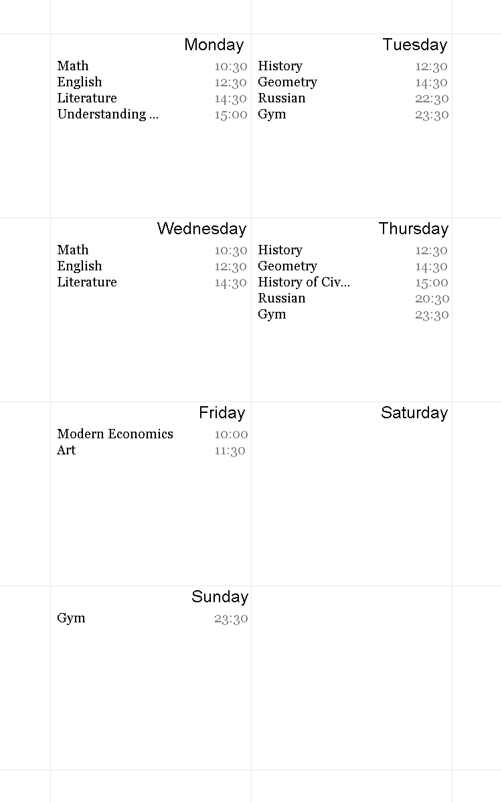

# TimetableGenerator

Personalize your mobile device by setting your everyday plans to your phone backgorund.

Input:

Gym: Tuesday 23:30 
Gym: Thursday 23:30

Math: Monday 10:30

Math: Wednesday 10:30

English: Monday 12:30

English: Wednesday 12:30

Literature: Monday 14:30

Literature: Wednesday 14:30

Russian: Tuesday 22:30

Russian: Thursday 20:30

History: Tuesday 12:30

History: Thursday 12:30

Geometry: Tuesday 14:30

Geometry: Thursday 14:30

Gym: Sunday 23:30

Art: Friday 11:30

Understanding Political Science: Monday 15:00

History of Civilization: Thursday 15:00

Modern Economics: Friday 10:00

Output:

